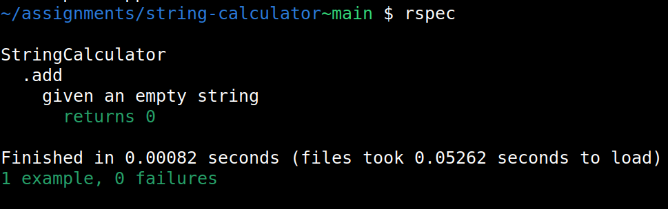
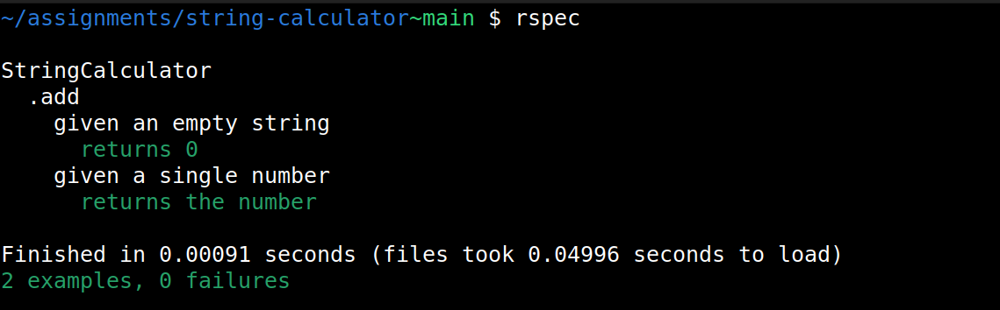
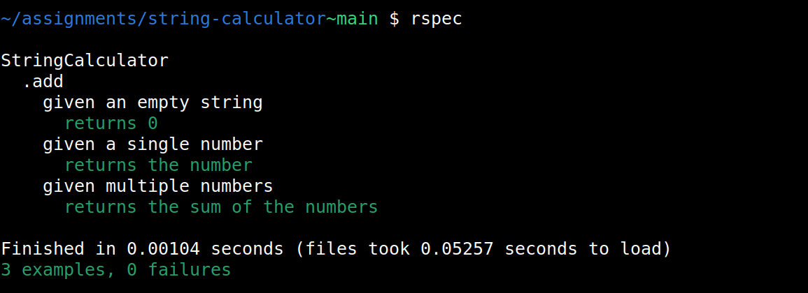
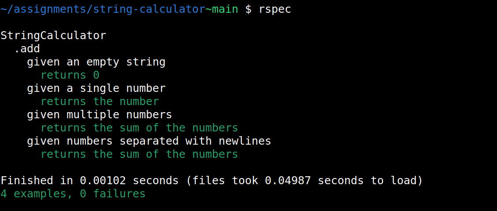
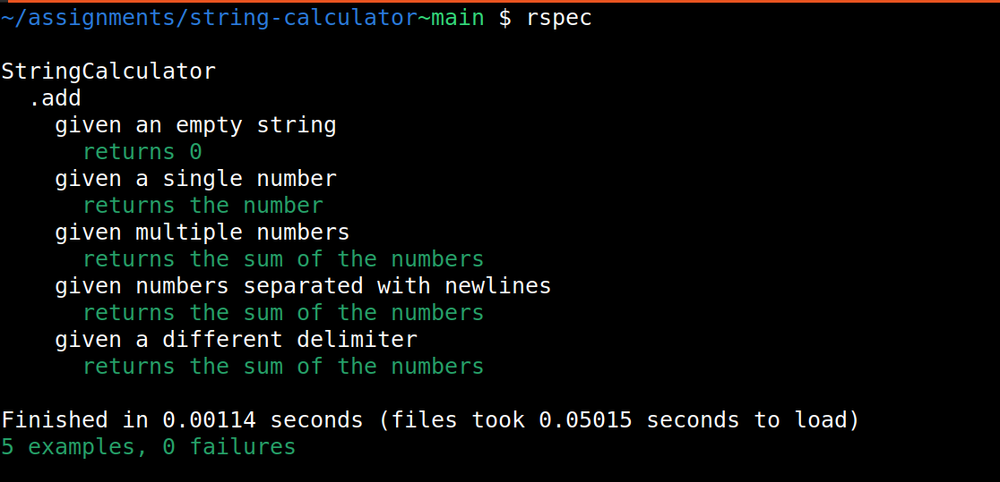
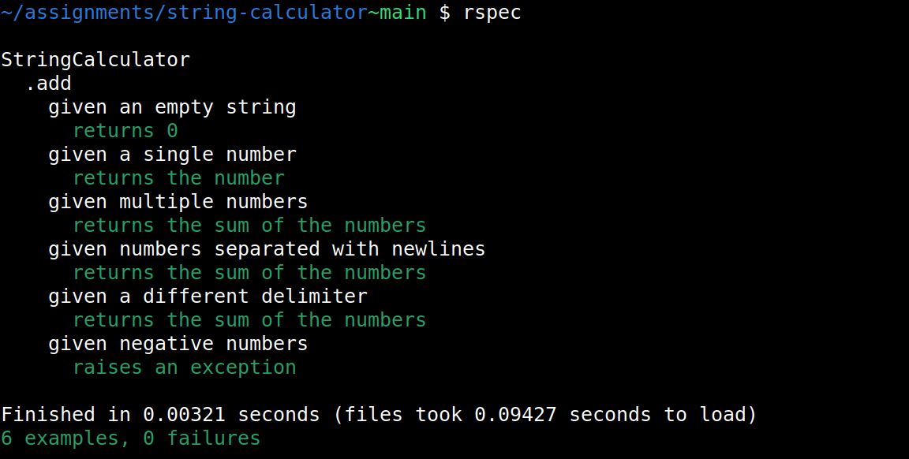
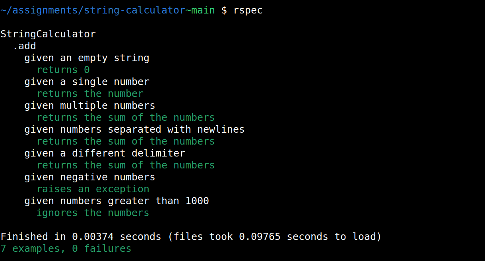
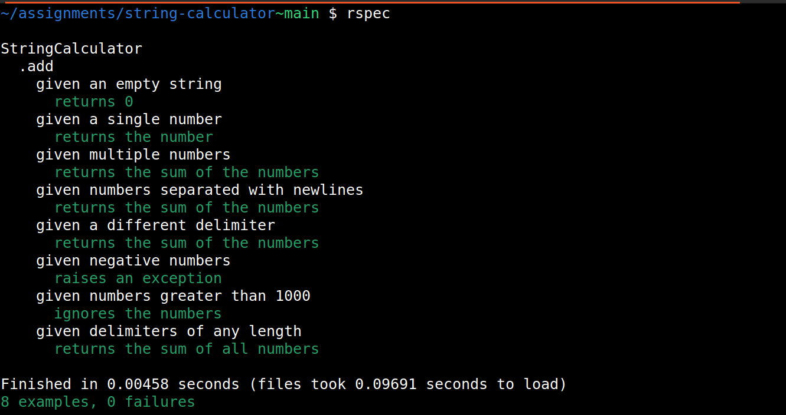
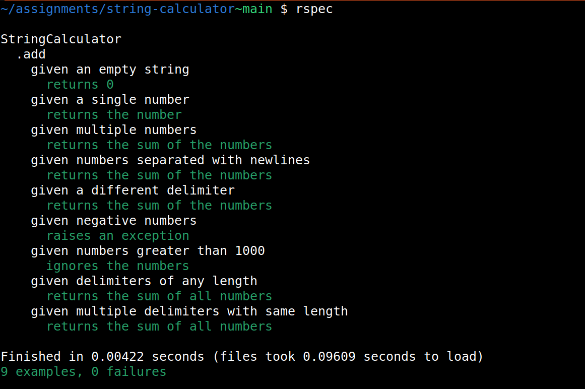
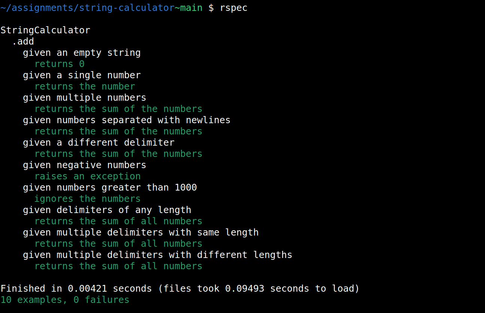

# String Calculator TDD Kata

This is an implementation of the String Calculator TDD Kata in Ruby, using RSpec for testing.

**Author:** Afzal Rahman A

## Requirements

The kata requires building a String Calculator with an `add` method that takes a string of comma-separated numbers and returns their sum.

Tests should be written for the following:

1. It should return 0 for an empty string "".
  

2. It should return the number for a single number:
  

3. It should return the sum of numbers for a string of multiple numbers:
  

4. It should handle new lines between numbers instead of commas:
  

5. It should support different delimiters:
  

6. It should throw an exception for negative numbers:
  

7. It should ignore numbers greater than 1000:
  

8. It should support delimiters of any length:
  

9. It should handle multiple delimiters with the same length:
  

10. It should handle multiple delimiters with different lengths:
   

## Setup

### Prerequisites

- Ruby (version used - 3.2.2)
- RSpec (version used - 3.13)

### Installation & Running the Tests

1. Clone the repository.
2. Install dependencies.
3. Navigate to the string-calculator directory.
4. To run the tests, execute:
  ```bash
  rspec
  ```
